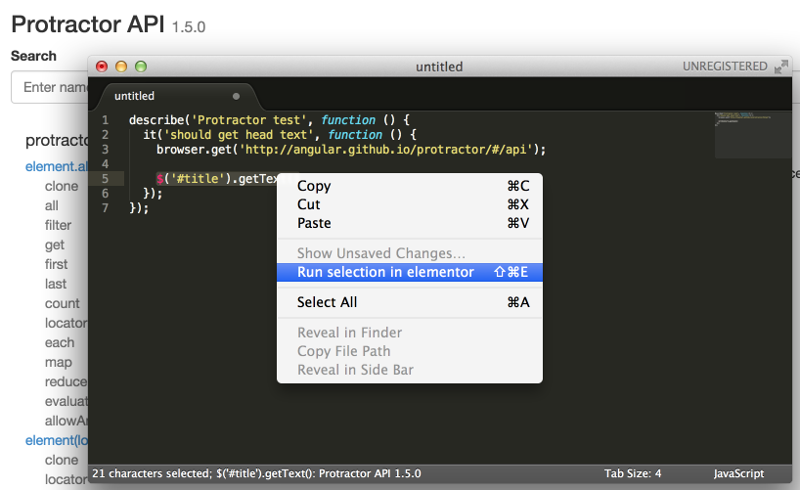

elementor-sublime
=================

A sublime plugin to connect to Protractor's elementor

## How to install it

Clone this repo

```shell
$ git clone https://github.com/andresdominguez/elementor-sublime.git
```

Create a directory called *Elementor* under Sublime's Packages directory and
copy the cloned directory

```shell
$ mkdir ~/Library/Application Support/Sublime Text 2/Packages/Elementor
$ cp elementor-sublime/* ~/Library/Application Support/Sublime Text 2/Packages/Elementor
```

## How to use it

Start [elementor](https://github.com/andresdominguez/elementor).

Go to a protractor test file, select the text you want to run on elementor,
right-click, and Choose "Run selection in elementor".



See the results in the status bar.

## Shortcuts

|Platform  | Shortcut        |
|----------|-----------------|
| Mac      | control SHIFT E |
| Windows  | Alt SHIFT E     |
| Linux    | Alt SHIFT E     |
